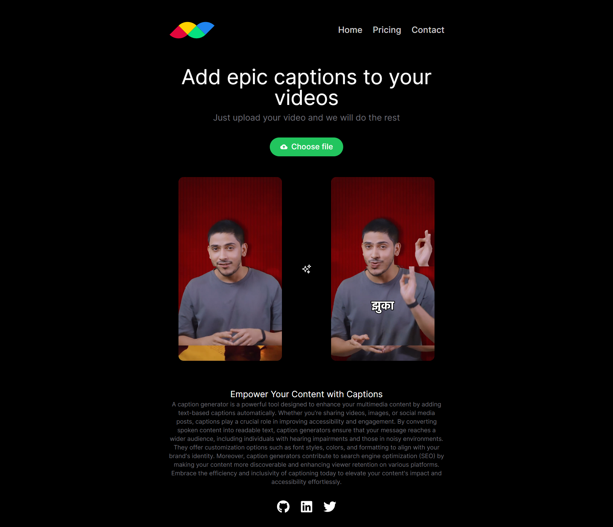

# Caption Generator

This project is a Next.js-based web application that generates captions for videos using AWS services such as S3 for storage and Transcribe for speech-to-text conversion. The application allows users to upload videos, obtain transcriptions, customize caption styling, and overlay captions onto the video content.

## Features

- **Video Transcription**: Automatically transcribes uploaded videos using AWS Transcribe, providing accurate text representations of spoken content.
- **Customizable Captions**: Users can customize caption appearance by selecting text color, outline, and other styling options to enhance readability and visual appeal.
- **AWS Integration**: Utilizes AWS S3 for video storage and AWS Transcribe for speech recognition, ensuring robust and scalable backend infrastructure.
- **Real-time Captioning**: Enables real-time preview of captions overlaid on the video, facilitating quick adjustments and visual verification.

## Technologies Used

- **Frontend**: Next.js, React
- **Backend**: AWS S3 (storage), AWS Transcribe (speech-to-text)
- **Styling**: Tailwind CSS
- **Deployment**: Vercel or AWS Amplify

## Getting Started

To run this project locally, follow these steps:

1. **Clone the repository**:
git clone https://github.com/hars310/caption_generate.git
cd caption-generator
2. **Install dependencies**:
3. **Set up AWS credentials**:
Ensure your AWS credentials (access key, secret key) are properly configured either through environment variables or AWS SDK configuration files.

4. **Start the development server**:
npm run dev
Open [http://localhost:3000](http://localhost:3000) in your browser to view the application.

## Deployment

This application can be deployed using Vercel, AWS Amplify, or similar services capable of hosting Next.js applications. Ensure to configure environment variables for AWS credentials and any other necessary configuration specific to your deployment environment.

## Usage

1. **Upload Video**: Start by uploading a video file to the application.

2. **Generate Caption**: Once uploaded, initiate the transcription process using AWS Transcribe to obtain the video's text representation.

3. **Customize Captions**: Customize the appearance of captions such as text color, outline, and positioning to suit your video's aesthetic and readability.

4. **Preview and Finalize**: Preview how captions look overlaid on the video in real-time. Make adjustments as needed and finalize the caption settings.

5. **Download or Export**: After finalizing, download or export the video with captions embedded for distribution or further editing.

## Contributing

Contributions are welcome! If you find any issues or have suggestions for improvements, please submit an issue or a pull request in the GitHub repository.
